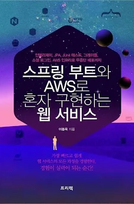

# Spring boot와 AWS로 혼자 구현하는 웹서비스 스터디(alone) 
 
 
:sparkles: 블로그에 버전관리 및 오류사항, 궁금증 등 정리 (최신 UPDATE : 22/08/01)  
:star: url : https://hxxxxxl.tistory.com/category/Spring/SpringBoot

:date: DATE : 22/04/20(수) ~ 22/04/28(목) , 22/08/01(월) ~ 22/08/31(예정)

- :books: 정리방법 : 개인적인 정리는 노션에 기록하고 있고 블로그에는 좀더 정리된 형태로 올릴 생각이다. 
나중에 다 쓰고 나서는 목차도 정리해서 책처럼 만들 예정
- :dart: 진도는 한주에 되도록 3번 정도 글쓰고 싶다. 빠르게 끝내고 다른거 할 예정이었는데 진도가 안빠져서 주 1,2회 점검 중이다.
- :speech_balloon: 현재(08/02) 노션에는 chapter 03까지 정리 완-료
- :fire: chapter 04 장 8월 완료,,, ㅎ

<진도>
- 04장 : 22/08/24(수) 머스테치

<변경 및 진행사항>
- 하다가 에러가 너무 자주나서 안하고 벌려놨다..
- 05장 : 22/09/12 시큐리티 진행중